# Invoice Registration System - Frontend (React)
This is the frontend of the **Invoice Registration System** - a secure, full-stack web application for managing invoices and customers. Built with **React** and **Vite**, this client connects to a Spring Boot REST API and includes JWT-based authentication and responsive UI using Bootstrap.

## 🚀 Tech Stack
- JavaScript (ES6)
- React
- HTML5 & CSS3
- Bootstrap
- React Router
- Axios
- Vite
- JWT (Authentication)

## 📦 Features
- User registration and login with validation
- JWT-based authentication (token stored in `localStorage`)
- Authenticated user data stored in `sessionStorage`
- Protected routes with React Router
- CRUD operations for invoices and customers
- Form validation and error handling
- Responsive layout using Bootstrap

## 📸 Screenshots
Below are key UI screens from the Invoice Registration System frontend.
<details>
<summary>🔐 <strong>Registration Form with Validation</strong></summary>

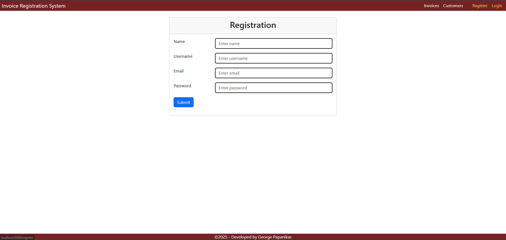
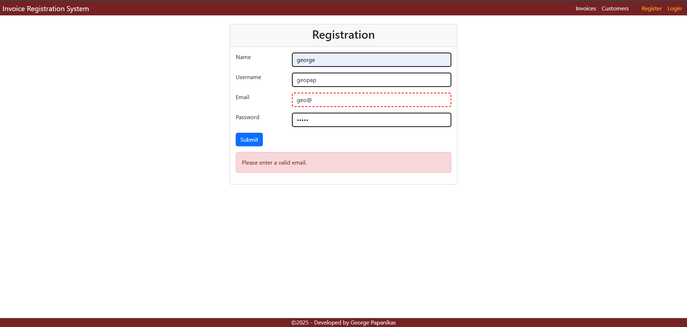
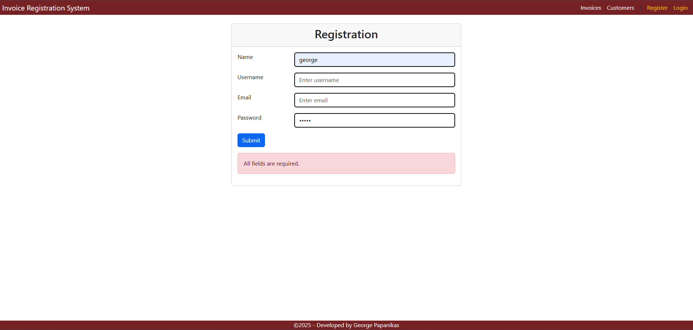

</details>

<details>
<summary>🔑 <strong>Login Page</strong></summary>

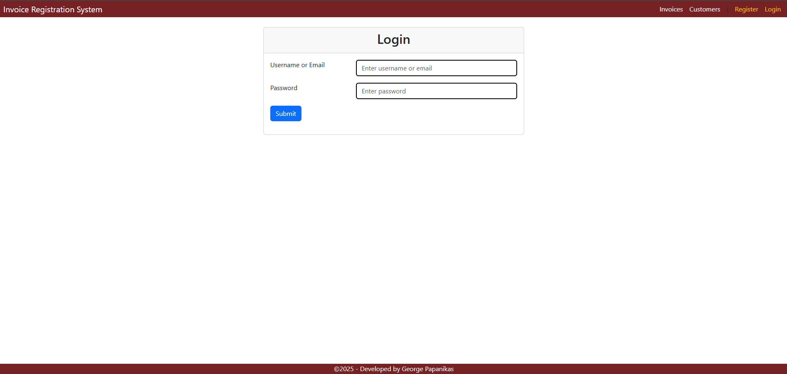
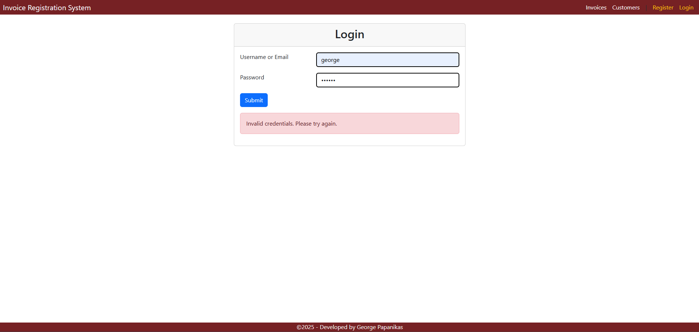

</details>

<details>
<summary>🧾 <strong>Invoices List</strong></summary>

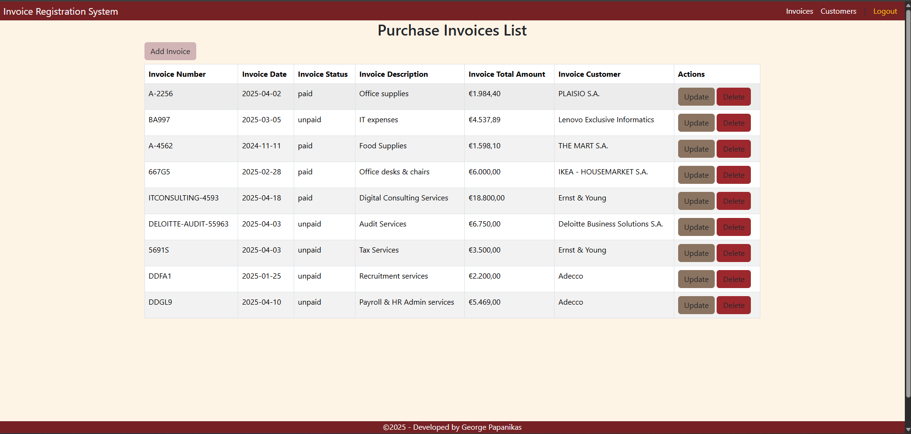

</details>

<details>
<summary>👥 <strong>Customers List</strong></summary>

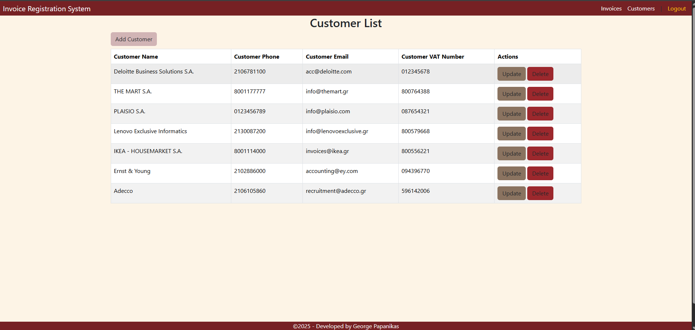
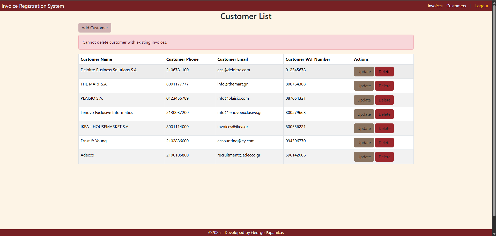

</details>

<details>
<summary>📝 <strong>Add Invoice Form</strong></summary>

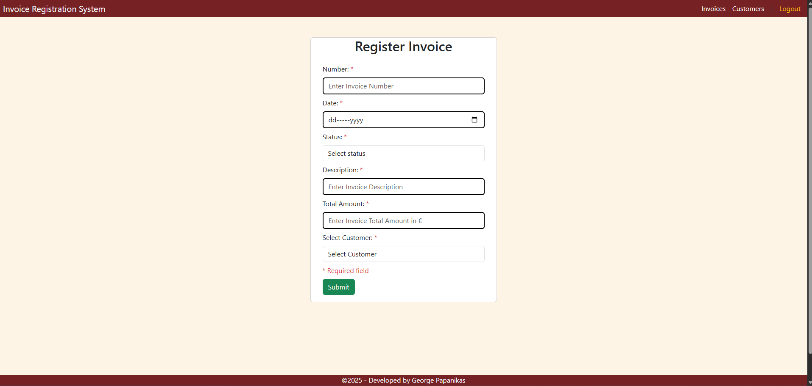
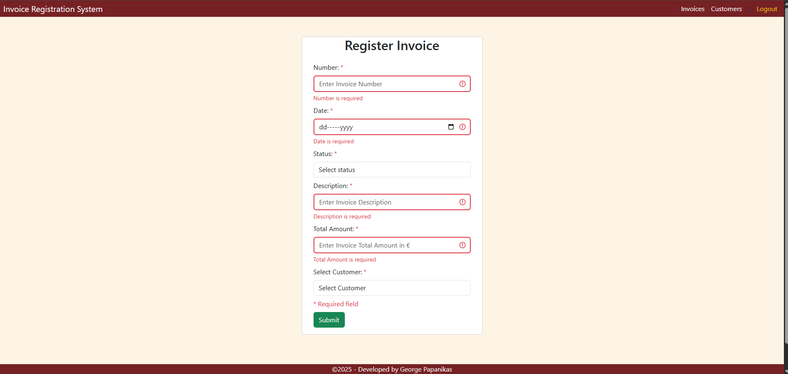

</details>

<details>
<summary>📋 <strong>Add Customer Form</strong></summary>

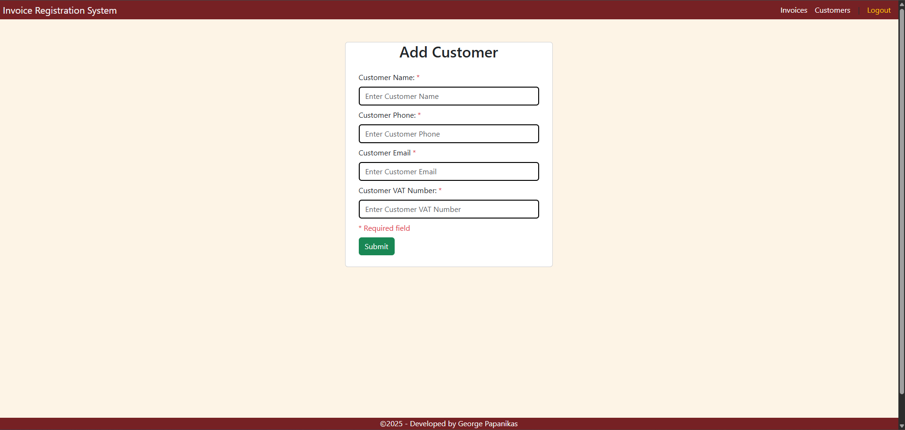
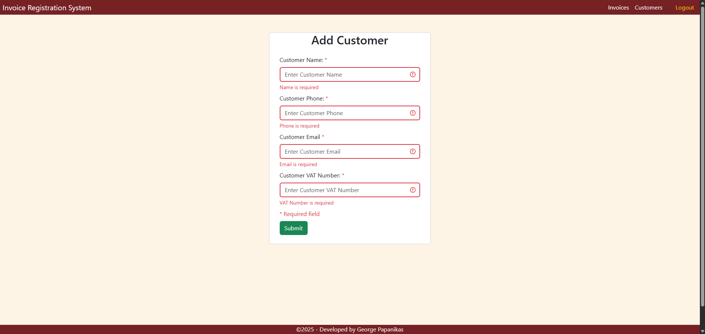

</details>

## 🔧 How to Run Locally
### 1. 🧬 Clone the Repository
```bash
git clone https://github.com/george-papanikas/invoice-registration-system-frontend.git
```
### 2. 📥 Install Dependencies
```bash
npm install
```
### 3. ▶️ Run the Application
```bash
npm run dev
```
💡 Make sure the backend is running at:
👉 http://localhost:8080

💡 The app will be available at: 
👉 http://localhost:3000 (customized Vite port)

## 🔐 Authentication
-	JWT tokens are saved in localStorage after login
-	Authenticated user details are stored in sessionStorage
-	Axios interceptors automatically include the token in API requests
-	Routes are protected using a custom wrapper around React Router

## 📁 Project Structure
```bash
src/
├── services/ # API logic (Axios)
├── components/ # UI components
├── App.jsx # App root component
├── App.css # Global styles
├── main.jsx # Entry point
```

## 👤 Author
**George Papanikas**  
Junior Software Developer  
[LinkedIn](https://linkedin.com/in/georgepapanikas) | [GitHub](https://github.com/george-papanikas)

## 📄 License
This project is licensed under the MIT License — see the LICENSE file for details.

## 🌐 Related Repository
🔗 [Backend (Spring Boot)](https://github.com/george-papanikas/invoice-registration-system-backend)
